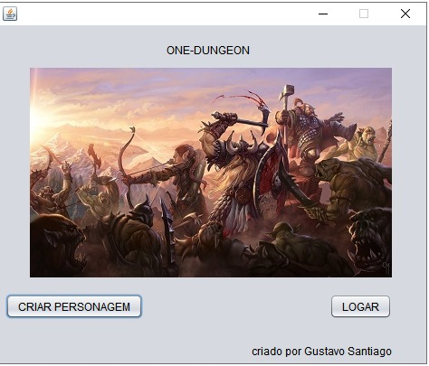
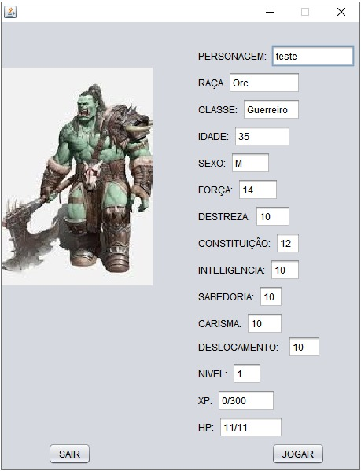
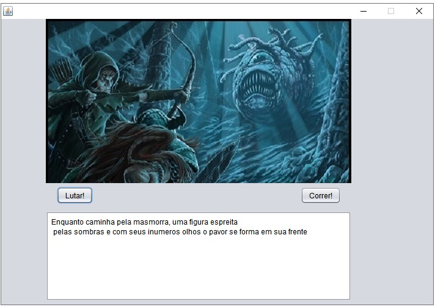
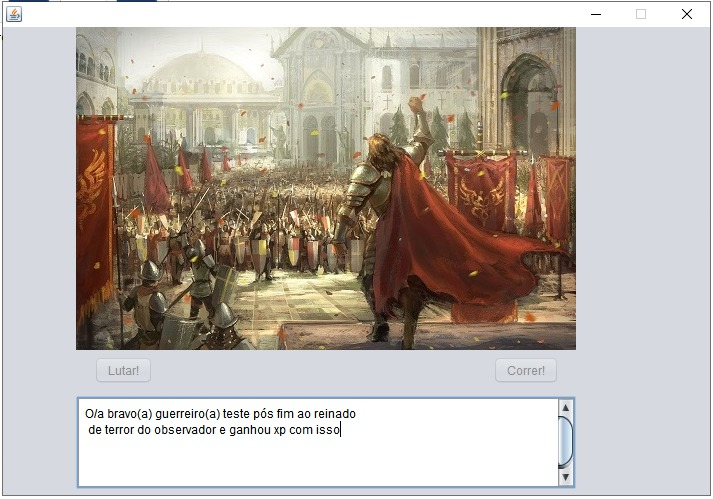
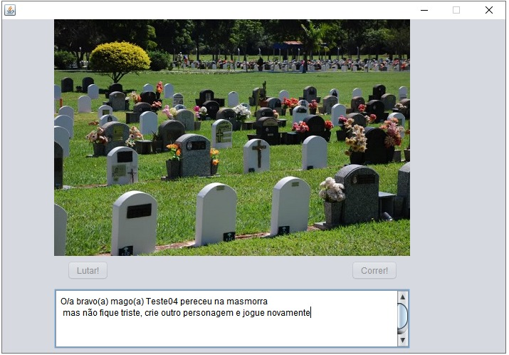

# One-Dungeon

project developed during the object-oriented programming discipline with IDE NetBeans 8.2 that simulates a text RPG based on the Dungeons & Dragons
RPG system, with some images (found on google images) and screens made with javaFx. To use just run the project in your IDE of preference

To login you need to enter the name of the character and his class, if it exists among the files,
a file with that character name and the corresponding class you will be logged in,
if there is no algorithm will create a new character at random.Or you can create a new character.

Within the game, you can fight or run from the monsters (which does not guarantee that you will be able to win the fight or flee)

obtaining the glory

or ... one more attempt at least

